# palantir-demo — 用 A 股投研台复刻 Palantir 的 Ontology

我平时主要写 iOS。前段时间看 Palantir 的资料，它反复在讲一个词：Ontology（本体）。
文档读了不少还是觉得隔着一层，索性用 TypeScript 从零造了一个最小可用的版本——
数据用科创板 50 的真实行情，做成一个能查、能算、能模拟调仓、能审计的投研运营台。

这个仓库就是结果。引擎代码里没有一个金融词汇，题材全部收在 `ontology/` 一个目录里。
换个题材（库存、工单、病历）只需要换掉这个目录——这不是口号，是验收清单里的一条 grep。

## 界面一览

不想跑也能看个大概（截图全部来自真实运行状态，`node scripts/take-screenshots.mjs` 可一键重生成）。

**语义元素：对象与链接**

50 只真实科创板 50 对象，过滤、排序，右栏是实时审计流，底部是闭环血缘条：

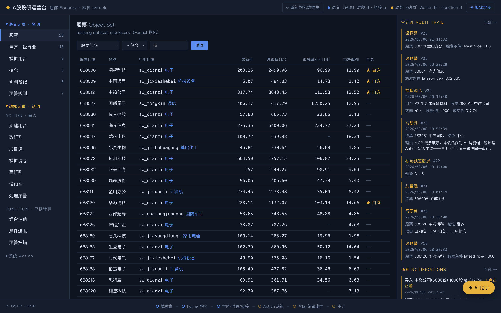

对象详情：属性卡 + 沿链接遍历（行业↔持仓↔研判↔预警）+ 相关动作：

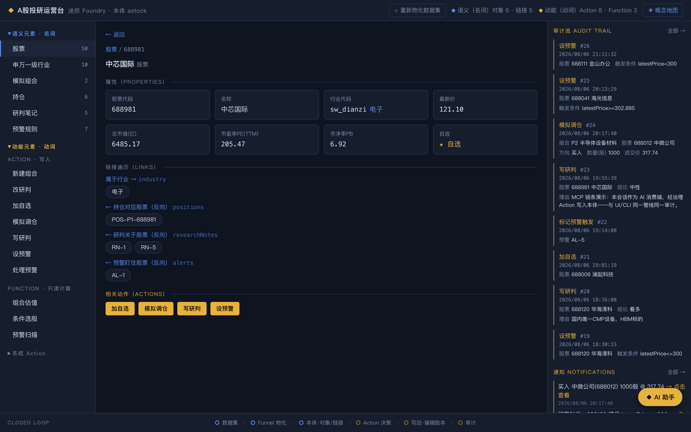

组合详情内嵌估值卡（Function 实时计算）：

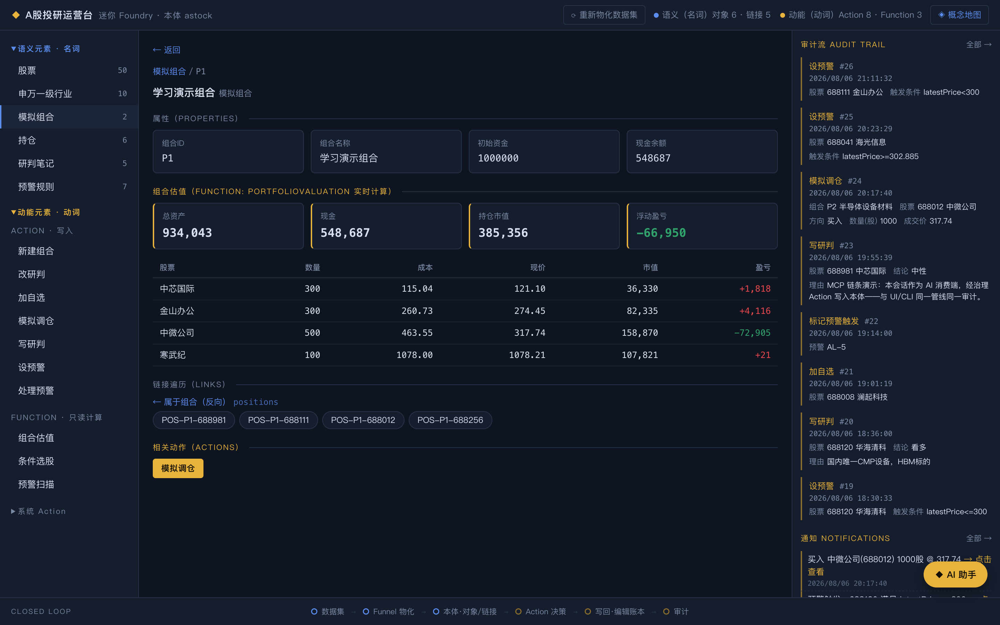

**动能元素：动词与治理**

模拟调仓：搜索选股、当前最新价一键填入、提交前提（Submission Criteria）逐条列出：

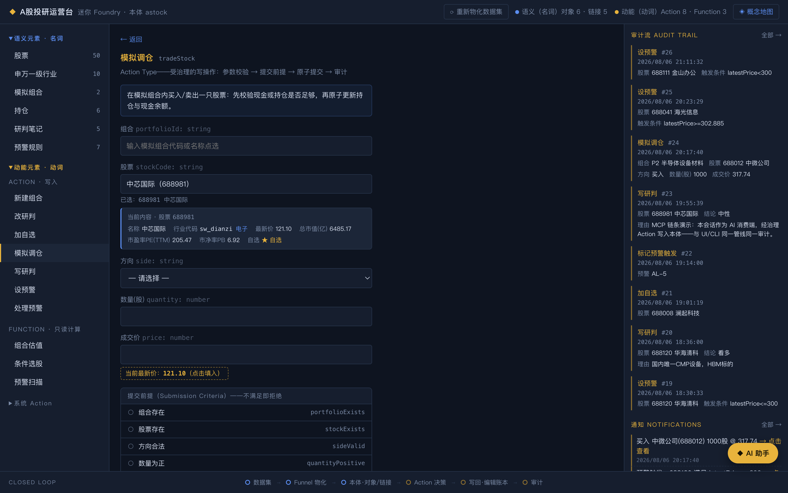

预警规则：代码自动翻名、状态彩色徽章、条件表达式带中文说明：

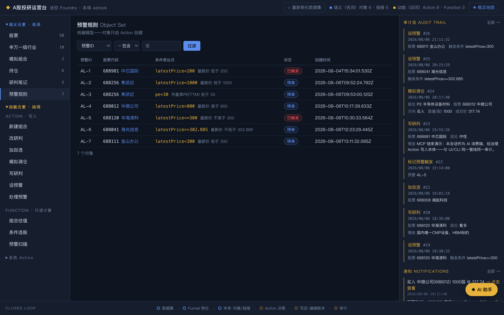

研判笔记（标题列来自一次"本体演进"：schema 加一个属性，全端自动跟上）：

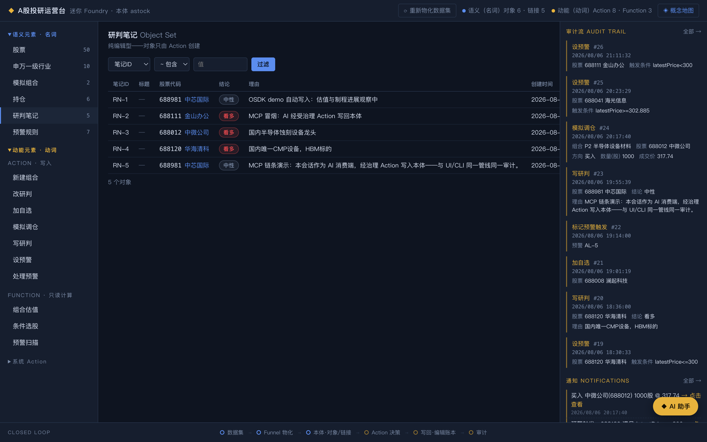

组合估值 Function：KPI 卡 + 持仓明细，标签全部来自元数据：

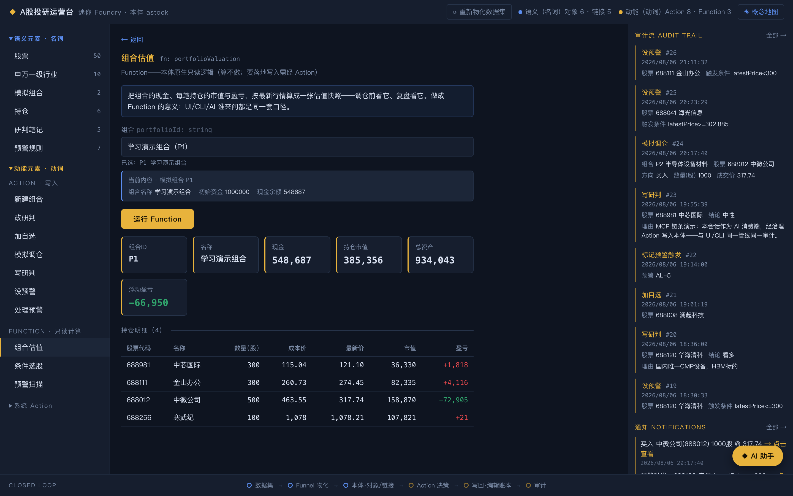

预警扫描：命中清单行尾直接给出系统动词「标记预警触发」——发现与落账分离：

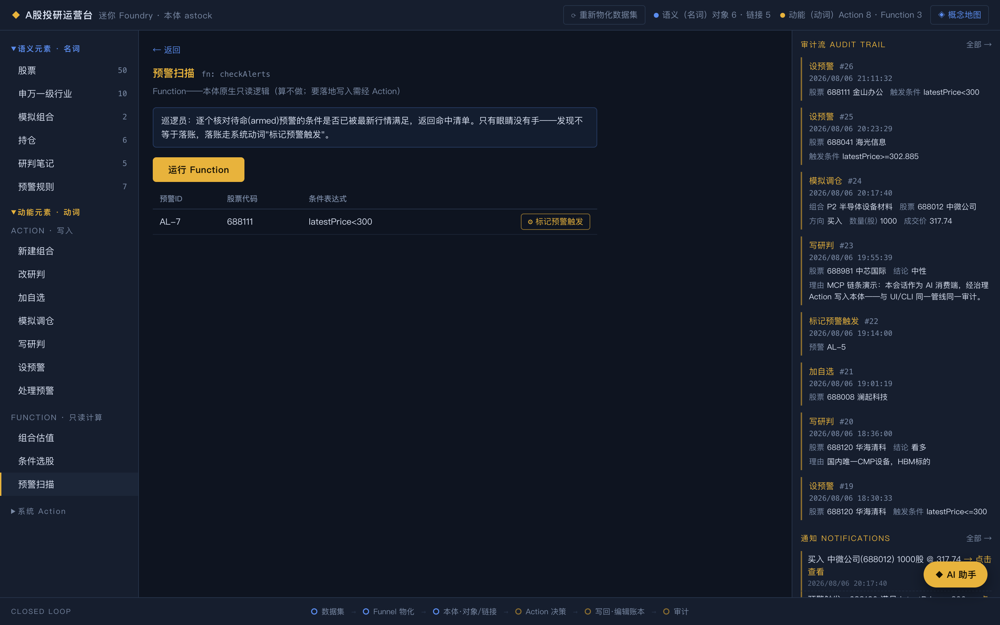

**审计、概念与 AI**

决策活动页：每一笔 Action 的完整留痕，分页可翻：

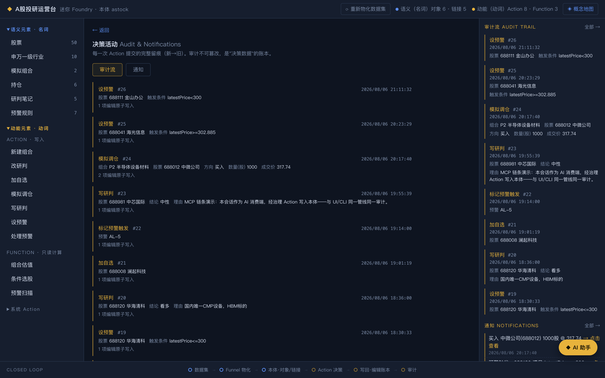

概念地图：核心词汇一页讲清：

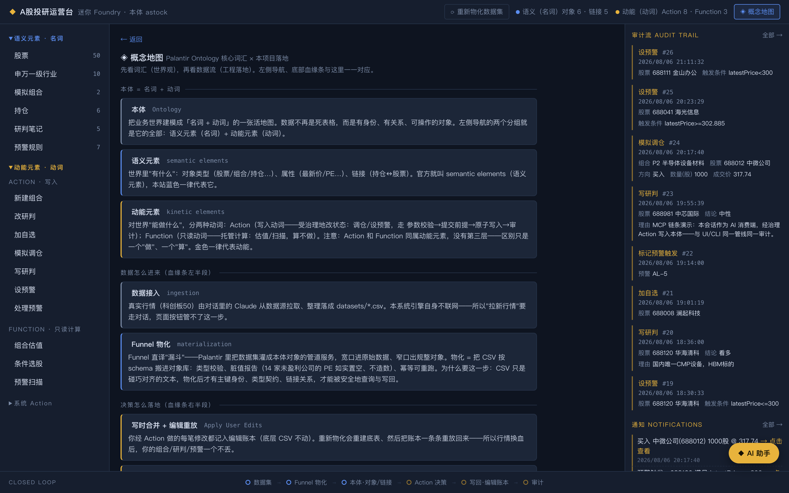

数据流向图：从数据源到四个消费端，存储与治理不变量都画在页面里：

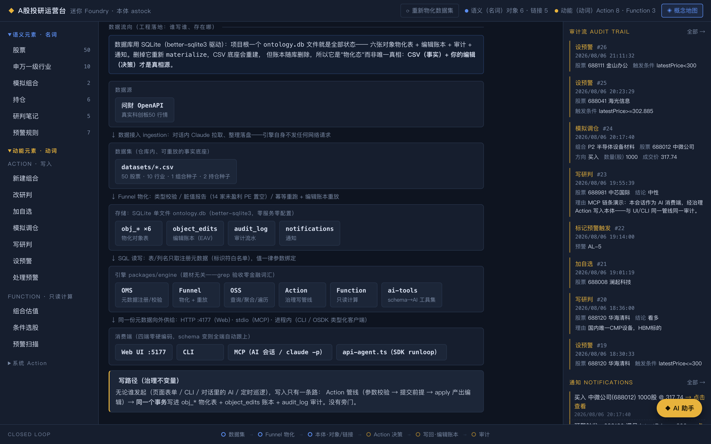

AI 助手实录：真实的一轮对话——工具调用时间线、估值回答、可展开的原始报文、多轮追问输入框：

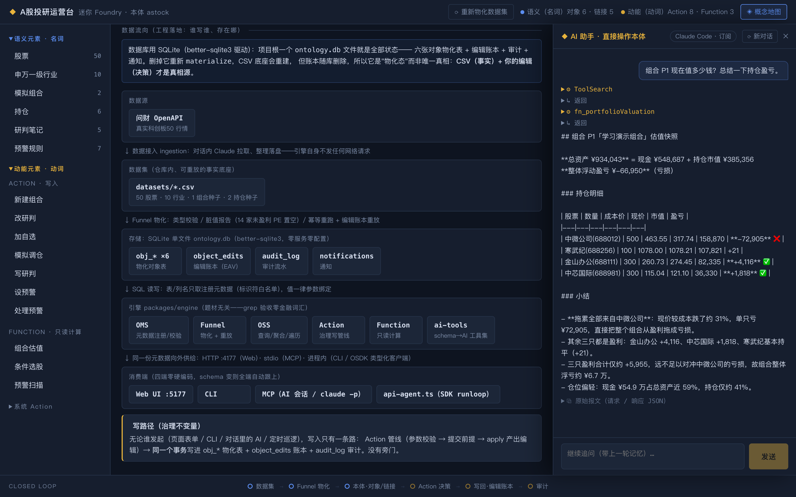

## 跑起来

前置：Node.js ≥ 20、pnpm ≥ 9，macOS / Linux / Windows 均可。三条命令，不需要任何数据库服务或密钥：

```bash
pnpm install                # 依赖（better-sqlite3 会自动构建）
pnpm cli materialize        # CSV → 本体对象，生成 ontology.db（含脏行报告）
pnpm --filter engine serve  # 本体 API :4177
```

另开一个终端起页面：

```bash
pnpm --filter web dev       # 运营台 http://localhost:5177
```

**AI 是可选的**：不配置任何 AI 凭据时，唯一不可用的是右下角的「AI 助手」对话
（点了会明确报错）；对象浏览、链接遍历、Action 提交、Function 计算、审计、重物化
全部正常——引擎本身不联网，AI 只是众多消费端之一。想开对话入口再按下节配。

## AI 对话入口

页面右下角有个「AI 助手」，用一句话就能操作整个本体：查估值、筛股票、扫预警、写研判。
AI 的写入和人点表单走的是同一条治理管线（前提校验 → 原子提交 → 审计），没有后门。

底层是一个桥的两条路，效果一致，按环境自动选：

| 环境 | 走哪条路 | 密钥 |
|---|---|---|
| 本机装了 [Claude Code](https://claude.com/claude-code) | 桥调用已登录的 `claude` CLI | 不用配，走订阅额度 |
| 有 Anthropic API key | 桥用 SDK 在进程内跑 tool-use 循环 | `export ANTHROPIC_API_KEY=...` 后重启 serve |

密钥只存在环境变量或本机登录态里，仓库里一个都没有。对话支持多轮追问（会话延续），
每轮回复末尾可以展开原始请求/响应 JSON——我自己调试时就靠它看数据到底长什么样。
（Windows 原生环境建议直接走 API key 这条路；CLI 驱动在 Windows 下推荐 WSL。
SDK 直连 Anthropic 需要网络可达，必要时配 HTTPS_PROXY。）

顺带一提：用 Claude Code 打开本仓库会自动连上 `.mcp.json` 里的本体 MCP server，
在编辑器对话里也能直接查询、执行 Action——和网页入口是同一套工具、同一条管线。

## 更新行情数据（可选）

仓库自带 2026-08-04 收盘后的真实科创板 50 快照，不更新也能完整体验。想换新行情有两条路：
在 Claude 会话里让 AI 从数据源拉取、整理落进 `datasets/*.csv`（我平时就这么干——依赖的是
我本机私有的金融数据技能，不随仓库分发），或者自写取数脚本生成同结构的 CSV
（列说明见 [datasets/README.md](datasets/README.md)，任何数据源都行）。
数据源密钥（同花顺问财 / 东方财富）的环境变量约定见 [.env.example](.env.example)——
引擎零联网，这些 key 只在取数那一步用，永不入库。换完 CSV 后点页面上的
「⟳ 重新物化数据集」或跑 `pnpm cli materialize`，你的组合、研判、预警会经编辑账本原样重放回来。

## 我对 Ontology 的理解

做完这个项目，我把文档里那些抽象概念落成了自己的话：

1. **本体 = 名词 + 动词。** 官方分 semantic elements（对象/属性/链接，世界上有什么）和
   kinetic elements（Action/Function，能对世界做什么）。数据字典只有名词；把动词也建模进去，
   世界才是可操作的。
2. **运营系统和分析系统的分界线是"写回"。** 报表只读世界，运营系统改世界。页面底部那条
   血缘条画的就是这个环：数据集 → 物化 → 对象 → Action → 写回 → 审计。
3. **算和做要分开。** Function 只读（估值、扫描），Action 写入且过治理。算错了没伤害，
   做错了要能追责。
4. **元模型驱动才换得来题材无关。** 引擎只认元数据，UI、CLI、AI 工具、类型化客户端四个端
   读同一份 schema 各自渲染。我后来给研判笔记加了个标题属性：列表多一列、表单多一项、
   AI 工具定义更新、数据库自动补列，全都没写一行端上的代码——那一刻才真正理解
   "本体演进"是什么意思。
5. **数据和决策分层。** CSV 是事实，我的操作是决策，分开记账。行情刷新重物化之后，
   编辑账本重放，决策一条不丢。Palantir 管这个叫 Apply User Edits。
6. **治理不看调用者的身份。** 人、CLI、AI 走同一条写入管线，留同一种审计。给 AI 的护栏
   不是限制它，而是把世界的写入口收窄成一组有前提、可审计的动词。
7. **脏数据要如实。** 科创板有 14 家未盈利公司，PE 就是空的——置空并出报告，不造数。
   数据集成的诚实度决定上层一切结论的可信度。
8. **本体是 AI 的世界接口。** 把 schema 翻译成工具清单交给模型，模型不需要提前了解你的
   系统——说明书就是本体本身。工具清单在会话建立时给一次（世界的结构），数据每轮现查
   （世界的状态），这个区分想明白之后很多设计就顺了。

## 架构

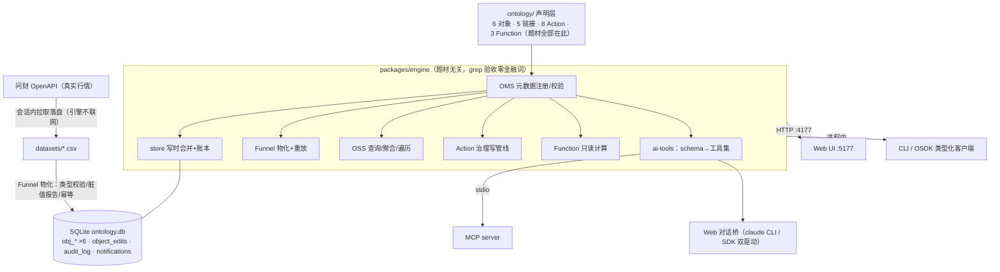

三个我自己最满意的设计决策：

| 决策 | 做法 | 换来什么 |
|---|---|---|
| 元模型驱动 | 引擎零题材词汇（grep 可验收）；SQL 标识符白名单 + 参数绑定 | 换题材 = 换一个目录，四个消费端零胶水 |
| 写时合并 + 账本重放 | Action 产出的编辑同事务三写（物化表 + EAV 账本 + 审计） | 数据换血决策不丢，每笔决策可回放 |
| schema 直出 AI 工具 | `buildTools(store)` 把本体翻成工具清单，MCP 和对话桥共用 | 新增一个 Action，AI 自动多一个工具 |

## 第一次打开建议看什么

1. 顶栏 **◈ 概念地图**：核心词汇 + 数据流向图，一页看懂整个系统；
2. 左栏「股票」：50 只真实科创板对象，点开详情沿链接遍历（行业↔持仓↔研判↔预警）；
3. 「模拟调仓」提交一笔（选股后成交价旁会提示最新价）→ 底部血缘条流动点亮 → 右栏审计多一条；
4. 「预警扫描」跑一次，命中行点「标记预警触发」——系统动词落账，通知可点击直达；
5. 顶栏「⟳ 重新物化数据集」：底层数据重建，你的修改原样都在；
6. 右下角「AI 助手」丢一句"查 P1 估值并总结"，展开看它调工具的完整过程。

## 一些工程上的坚持

- 全程 TDD，77 个测试先红后绿。实现计划里的测试当行为契约用，不为凑通过改测试。
- 每个里程碑都留了人工验收记录（`docs/acceptance/`）。验收真抓出过问题：题材词泄漏进引擎、
  schema 演进后旧库缺列、AI 子会话继承了本机开发环境……都是先有记录再有修复。
- 数据是真实的，空值也是真实的。宁可页面上有一排"—"，不造一个数。

## 目录

| 路径 | 是什么 |
|---|---|
| `ontology/` | 题材的全部：对象/链接/Action/Function 声明（换题材改这里） |
| `packages/engine/src/` | 题材无关引擎：types / oms / store / funnel / oss / actions / functions / ai-tools / codegen / server |
| `packages/engine/chat-bridge.ts` | 对话桥：claude CLI / Anthropic SDK 双驱动，多轮会话 |
| `packages/web/` | React 运营台，全部由 `/api/schema` 元数据驱动渲染 |
| `packages/mcp/` | MCP 薄壳（stdio 接线，工具来自 engine/ai-tools） |
| `datasets/` | 真实科创板 50 行情 CSV（事实底座，含数据说明） |
| `examples/` | 参考：手写 SDK runloop、每日定时巡逻脚本 |
| `docs/` | 前期调研、引擎模块详解、各里程碑验收记录 |
