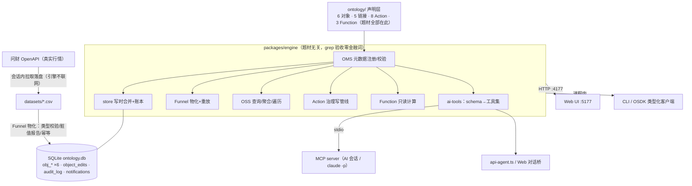

# palantir-demo — 用 A 股投研运营台复刻 Palantir Ontology

一个把 **Palantir Foundry Ontology 思想**完整走一遍的工程实践：声明式 Schema、题材无关本体引擎、
治理写回管线、以及三种形态的 AI 接入。题材选了 A 股投研（数据域：科创板 50 成分股，真实行情），
但引擎里没有一个金融词——**题材只是外衣，元模型才是本体**。

读文档十遍，不如亲手造一个。这个仓库就是那个"亲手造的"。

---

## 对本体论的思考（做完这个项目后的理解）

1. **本体 = 名词 + 动词的一张活地图。** 官方把它分成 semantic elements（语义元素：对象/属性/链接——世界上*有什么*）
   和 kinetic elements（动能元素：Action/Function——对世界*能做什么*）。数据字典只有名词；本体把动词也纳入建模，
   世界才"可操作"。
2. **运营系统与分析系统的分界线是"写回"（closing the loop）。** 报表只读世界；运营系统改世界。
   本项目底部的血缘条（数据集 → 物化 → 对象 → Action → 写回 → 审计）就是这条环，每次提交 Action 它会流动点亮。
3. **算与做分离。** Function 只读（估值、扫描——巡逻员只有眼睛没有手），Action 写入（走 参数校验 → 提交前提 →
   原子提交 → 审计 的治理管线）。算错了没有伤害，"做"必须有护栏。
4. **元模型驱动 = 题材无关。** 引擎只认元数据（OMS 注册的 schema），UI / CLI / AI 工具 / 类型化 SDK 四个消费端
   读同一份元数据渲染自己。给 `ResearchNote` 加一个 `title` 属性：列表多一列、表单多一项、AI 工具 schema 自动更新、
   数据库自动补列——**一处声明，四端跟上**，这就是本体演进的含义。
5. **数据与决策分层（Apply User Edits）。** 底层 CSV 是"事实"，你经 Action 做的修改是"决策"，二者分开记账
   （物化表 + 编辑账本）。行情重物化换血后，账本重放把决策一条条盖回来——事实可以刷新，决策永不丢失。
6. **治理不因调用者放松。** 人点表单、CLI 敲命令、AI 发工具调用，写入走的是同一条 Action 管线、留同一种审计。
   AI 时代的护栏不是"限制 AI"，而是把世界的写入口收窄到一组有前提、可审计的动词上。
7. **脏数据是一等公民。** 科创板 14 家未盈利公司的 PE 是真实空值——如实置空并出报告（`nulled`），不造数、
   不静默丢弃。数据集成的诚实度决定了上层一切结论的可信度。
8. **本体是 AI 的世界接口（OAG）。** 把 schema 翻译成工具集（16 个工具：查询/遍历/聚合 + 每个 Action/Function
   一个），LLM 拿着工具清单在 runloop 里自主决策。模型不需要"了解你的系统"——本体就是说明书。

## 架构



三个签名设计决策：

| 决策 | 做法 | 换来什么 |
|---|---|---|
| **元模型驱动** | 引擎零题材词汇（CI 可 grep 验收）；标识符白名单 + 参数绑定双防线 | 换题材=换一个 `ontology/` 目录；四端零胶水 |
| **写时合并 + 账本重放** | Action 产出的编辑同事务三写（物化表 + EAV 账本 + 审计）；重物化后重放 | 数据换血决策不丢；每笔决策可回放可追责 |
| **OAG 工具化** | `buildTools(store)` 把本体翻成 AI 工具清单，MCP/SDK/对话桥共用 | 新增一个 Action，AI 自动多一个工具 |

## 五分钟跑起来

```bash
pnpm install
pnpm cli materialize        # CSV → 本体（含脏行报告）
pnpm --filter engine serve  # 本体 API :4177
pnpm --filter web dev       # 运营台 :5177
```

**AI 对话入口（页面右下角"◆ AI 助手"）的两种凭据方案——密钥永不进仓库：**

| 场景 | 做法 | 计费 |
|---|---|---|
| 本机装了 [Claude Code](https://claude.com/claude-code) | 什么都不用配——桥自动 spawn 已登录的 `claude` CLI | 订阅额度，零 API key |
| 没有 Claude Code / 想用自己的 key | `export ANTHROPIC_API_KEY=sk-ant-...` 后重启 serve | 按量计费（[获取 key](https://console.anthropic.com/)） |

驱动自动选择（有 key 走 SDK，否则走 CLI），`CHAT_DRIVER=api|claude-cli` 可显式指定。
AI 的每次写入照走 Action 管线并留审计——治理不因调用者是 AI 而放松。

其余 AI 形态：`.mcp.json`（Claude Code 打开本仓库即连 16 个本体工具）、`examples/daily-patrol.sh`
（每日定时巡逻，launchd 模板见 `examples/launchd/`）、`examples/api-agent.ts`（手写 SDK runloop，生产形态）。

## 建议动线（第一次打开看什么）

1. 顶栏 **◈ 概念地图**——词汇表 + 数据流向图，一页看懂整个系统；
2. 左栏「股票」看 50 只真实科创板对象 → 点开详情走链接遍历（行业↔持仓↔研判↔预警）；
3. 「模拟调仓」提交一笔（选股后成交价旁会提示最新价）→ 底部血缘条流动点亮 → 右栏审计多一条；
4. 「预警扫描」跑一次 → 命中行点「⚙ 标记预警触发」→ 系统动词落账、通知可点击直达；
5. 顶栏「⟳ 重新物化数据集」→ 观察"编辑已重放保留"——你的所有修改都还在；
6. 右下角「◆ AI 助手」丢一句"查 P1 估值并总结"——看它调工具的完整过程。

## 工程方法

- **TDD**：77 个测试先红后绿；实现计划里的测试是行为契约，不为凑通过改测试；
- **验收文化**：每个里程碑"自动化全绿 → 人工逐项验收附证据（`docs/acceptance/`）→ 抽查"；
- **硬约束机制化**：题材无关用 grep 验收、标识符防线在 OMS、脏数据必出报告（见 `CLAUDE.md`）；
- **状态可续接**：`PROGRESS.md` 罗盘 + 原子 commit——只读 git log 就能复原全程决策线。

## 目录导览

| 路径 | 是什么 |
|---|---|
| `ontology/` | 题材的全部：对象/链接/Action/Function 声明（换题材改这里） |
| `packages/engine/src/` | 题材无关引擎：types / oms / store / funnel / oss / actions / functions / ai-tools / codegen / server |
| `packages/engine/chat-bridge.ts` | Web 对话桥（驱动自动切换，部署组装层） |
| `packages/web/` | React 运营台（全部由 `/api/schema` 元数据驱动渲染） |
| `packages/mcp/` | MCP 薄壳（stdio 接线，工具来自 engine/ai-tools） |
| `datasets/` | 真实科创板 50 行情 CSV（事实底座，含数据说明） |
| `docs/ontology-research.md` | 前期调研：官方文档逐条论断 + 对抗验证 |
| `docs/learning/` | 引擎模块详解（含术语表） |
| `docs/acceptance/` | 各里程碑验收证据 |
